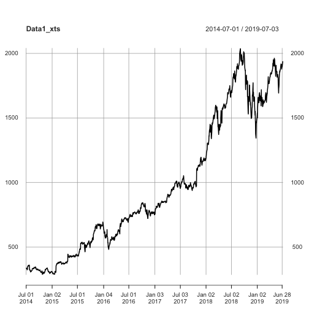

Time Series Viewer
========================================================
author: Hidai Bar-Mor 
date: 08.07.2019
autosize: true

Introduction
========================================================


- This app shows you the time series data of the Fang stocks
- You can upload a csv file with two columns of date and price and use the app
- This app makes a prediction using linear regression

App Description
========================================================
-Example for the data you get about the stocks you analyze:

```r
summary(data.frame(read.csv("data/amazon.csv"))[,2])
```

```
   Min. 1st Qu.  Median    Mean 3rd Qu.    Max. 
  286.9   533.2   817.9   965.7  1500.0  2039.5 
```

Plot Example
========================================================
Example for the plot of Amazon stock for the past five years:

Thank You!
========================================================
